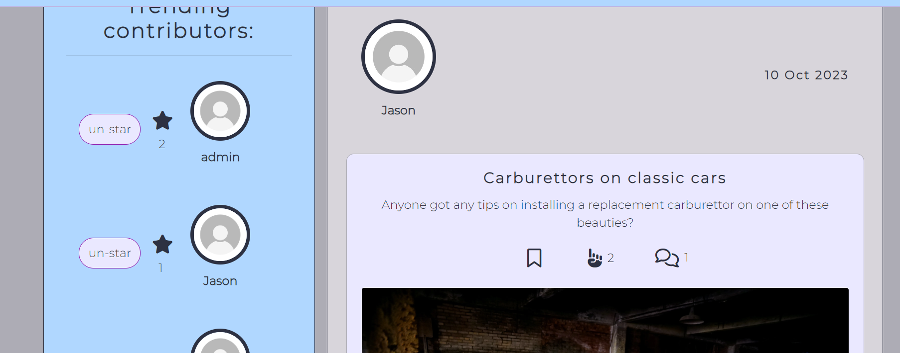

# **Fixit Forum**

Created by: Jeremy Simons
[Link to live site](https://ci-pp5-fixit-eda4cb59906b.herokuapp.com/)

This documentation covers the design, features, hosting, and testing of the React front end of this application. For details on the back end please visit [this repository](https://github.com/jeremyhsimons/fixit_drf_api)

## Introduction

Fixit is the forum for any budding DIY enthusiast to link up with like minded tinkerers to solve problems together. Where developers pool knowledge on platforms like [Stack Overflow](https://stackoverflow.com/), Fixit aims to be the go-to place for any user to find help solving their problem. After all, why should people struggle alone when most technical problems (whether a busted bike derailleur or a blocked drain) have probably already been solved?

This first iteration of the site has a separate front end and back end design. User data is stored and distributed via a Django REST API, and the front end site which users interact with is a separate application made using React. This first iteration focuses user content into 3 main categories: 
1. Bikes, cars, and other vehicular mechanics.
2. Electronics and circuitry
3. A more general DIY category that could cover most home improvement projects/problems.

## Contents
* [Project Goals](#project-goals) 
    * [For the user](#for-the-user)
    * [For the site owner](#for-the-site-owner)
* [User Experience](#user-experience) 
    * [Target audience](#target-audience)
    * [User requirements](#user-requirements)
    * [User Manual](#user-manual)
    * [User Stories](#user-stories)
* [Design](#design)
    * [wireframes](#wireframes)
* [Features](#features)
    * [Feature Ideas for future development](#feature-ideas-for-future-development)
* [Technologies Used](#technologies-used)
* [Deployment & Local Development](#deployment--local-development)
    * [Heroku deployment](#heroku-deployment)
    * [Forking GitHub Repository](#forking-github-repository)
    * [Cloning GitHub Repository](#cloning-github-repository)
* [Testing](#testing)
* [Validation](#validation)
* [Bugs](#bugs)
* [Credits](#credits)

## Project Goals

### New users
* To be able to sign up and post about a problem I'm having in a specific category of DIY
* To be able to view comments and suggestions from other users who can help me.
* To be able to scroll and search posts so that I can content from users who might have had the same issue as me.
* To upvote and star users/posts/comments that were helpful to me as a means of saying thank you.

### Existing users
* To comment on other users' posts so that I can help them and earn upvotes and stars.
* To see a list of popular profiles and see how close I am to being one of the top contributors.

## User Experience

### Target audience
* Bike and car enthusiasts who have an interest in maintaining their own vehicles.
* Electronics and hardware enthusiasts.
* Home Improvement enthusiasts, or new home owners looking for advice.
* Anyone interested in solving a one-off problem.
* Potentially other groups of enthusiasts as and when new categories are added to the database.

### User requirements

* To be able to scroll infinitely through a post list to browse content.
* To be able to search for posts and users based on keywords.
* To be able to bookamrk a helpful post in my account so that I can revisit it later.

### User Stories

#### Authentication

(1) As a new user I want to sign up so that I can use the site
(2) As an existing user I want to be able to sign in to the site to resume using the features
(3) As an existing user I want to be able to close and reopen the site without being logged out after a short period of time.
(4) As an existing user I want to be able to sign out from the app to protect my account.
(5) As an existing user I want to update my username and password so that I can keep my security details up to date.

#### Navigation

(6) As a new user I want to be directed to the home page if I try to access any feature that is not permitted for unauthenticated, so that the site can remain secure.
(7) As an existing user I want to access all the features of the site through one simple navbar at the top of the page.
(8) As an existing user I want to access a list of the most popular profiles on the site on a sidebar/sidenav, so that I can easily see who is most influential.
(9) As an existing user I want to switch between different kinds of DIY post so that I can see content that is relevant to me.
(10) As an existing user I want to be able to search for posts using a search bar so that I can quickly look up posts that are relevant to me.

#### Profiles

(11) As a new user I want to have a profile automatically generated for me when I log in so other users can interact with me.
(12) As an existing user I want to be able to edit my profile so that I can keep my public details up-to-date.
(13) As an existing user I want to scroll a list of the most popular profiles (that have received the most stars) that I can access their posts.
(14) As an existing user I want to be able to access a single profile to view its details and the posts associated with it.
(15) As an existing user I want to ‘star’ a profile of someone I like/have found helpful so that I can see more of their content in future.
(16) As an existing user I want to ‘un-star’ a profile when I no longer wish to see content from this user.

#### Posts

(17) As a new user I want to be able to create a post, so that I can ask my question/share my DIY problem with the community.
(18) As a new user I want to ‘infinitely’ scroll down a list of posts so that I can keep viewing content on the site.
(19) As a new user I want to be able to access a single post so that I can read it in full and read all the comments associated with it.
(20) As a new user I want to be able to bookmark a post I found helpful so that I can return to it later and re-read it.
(21) As a new user I want to upvote a post that is very timely or relevant, or if I’m sharing the same problem, so that I can support other members of the community and shape what is important on the site.
(22) As an existing user I want to remove a bookmark from a post so that I no longer have it saved.
(23) As an existing user I want to remove a post upvote from a post so that I no longer lend my support to that post.
(24) As an existing user I want to be able to edit my post so that I can correct any mistakes/keep my question up-to-date.
(25) As an existing user I want to be able to delete my post so that I can get rid of any unwanted or irrelevant data on the site.

#### Comments

(26) As a new user I want to be able to write a comment on a post so that I can interact with the person who created the post.
(27) As an existing user I want to be able to edit my comment so that I can fix any mistakes I made initially.
(28) As an existing user I want to be able to delete my comment so that I can withdraw what I posted initially.
(29) As an existing user I want to infinitely scroll through all the comments associated with a post (ordered by most upvoted) so that I can follow threads of answers and suggestions to other users’ problems.
(30) As an existing user I want to be able to upvote a comment so that I can lend my support to a contribution that helped me significantly.
(31) As an existing user I want to be able to withdraw my comment upvote so that I can withdraw my support for the commenter’s response

## Design

#### Fonts

[Google Fonts](https://fonts.google.com/) CDN was used to supply the fonts for this site.

Montserrat light was chosen as the font for site content because of its readability.

#### Colours

[Coolors.co](https://coolors.co/104f55-32746d-f4d8cd-01200f-011502) was used to generate the color palate of the site.

### Front End Libraries

[React Bootstrap v4](https://react-bootstrap-v4.netlify.app/) was used to expedite the front-end development process, specifically to provide row, column, and container components to order site content positionally.

Additionally the Image component was used extensively throughout the site to speed up formatting of images rendered on the front end.

[Font Awesome](https://fontawesome.com/) CDN was used to provide icons for the site.

The following React Libraries were also used:
* [React Router DOM](https://www.npmjs.com/package/react-router-dom) for linking internal urls in the site.
* [React MSW](https://mswjs.io/) for creating mock endpoints for testing.

### Wireframes

#### Phone screens

    
Authentication

    

    
Home

    

    
Profile

    

    
Post form

    

#### Tablet screens

    
Authentication

    

    
Home

    

    
Profile

    

    
Post form

    

#### Desktop screens

    
Authentication

    

    
Home

    

    
Profile

    

    
Post form

    

## Agile workflow

### Introduction

A Github projects kanban board was used to manage the tasks in the project. User stories were organised into epics and this guided how features in the backlog were organised for any given sprint.

Sprint 1: Navigation and Authentication

Sprint 2: Posts (CRUD) (+ Bookmarks + Upvotes)

Sprint 3: Comments (CRUD) (+ Upvotes)

Sprint 4: Profiles (+ Stars)

Screenshots:

### Flexibility

This approach to organising the project allowed for feature implementation to be assessed at each sprint. Each user story was assigned a label based on priority:

* Must have
* Should have
* Could have

Must-have features were all implemented, however upon starting the profiles sprint it became clear that there were too many features for the scope of this sprint so in order to maintain the best user experience with the existing features, the user story for a page on the site with a scrollable list of profiles that the user had 'starred' was given another label: 'wont have' to indicate that the first version of this site would not include this feature.

This does not mean that the site will never have this feature, and this user story has, in fact, been moved to the 'feature ideas for future development' section of this document.

## Features

### Authentication

#### Sign Up Page
* A form to create a new account for Fixit. 
* Uses password validation built into django rest auth.
* Any form errors are displayed to users.
* User stories covered: 1

    
Screenshots

    

#### Sign In Page
* A form that allows users to access all the sites features upon successful authentication.
* In the background, a JWT is issued to the user so that they can remain logged in for 24 hours, even if they close the browser in the meantime.
* User stories covered: 2, 3

    
Screenshots

    

#### Sign Out Button
* Allows the user to sign out from the navigation bar.
* Allows them to keep their account secure by destroying/invalidating the JWT that normally keeps them logged in.
* User stories covered: 4

    
Screenshots

    

#### Update Username & Password Forms
* Allows users to update their username and password respectively.
* Allows users to customise their profile, and also to keep their account secure by regularly updating passwords.
* User stories covered: 5

    
Screenshots

    
    

### Navigation

#### Auto redirect to signin
* Code in the background does not allow unauthorised users to access restricted parts of the site such as post creation.
* User stories covered: 6

    
Screenshots

    
    
    

#### Navbar
* Always appears at the top of the page.
* Contains links to all the most important parts of the site.
* Is fully responsive and adjusts to hamburger menu/icons on smaller screens.
* User stories covered: 7, 9

    
Screenshots

    

#### Searchbar
* Appears at the top of every post feed in the site.
* Allows users to search for keyowrds in post titles and usernames.
* User stories covered: 10

    
Screenshots

    

### Profiles

#### Auto-create profile
* When a new user logs in for the first time their profile page is accessible straight away.
* User stories covered: 11

#### Edit profile
* A form accessible from the profile page that allows users to update their public details including their bio, status and profile image.
* User stories covered: 12

    
Screenshots

    

#### Popular profiles
* A list of the 5 most-starred profiles in the community. From here users can star or unstar other users.
* User stories covered: 13, 15, 16

    
Screenshots

    

#### Single profile
* A page for viewing a single profile where users can see the public details of other users. From here users can also star or unstar another user's profile"
* User stories covered: 14, 15, 16

    
Screenshots

    

### Posts/comments

#### Create post form
* A form that allows users to specify the post title, content, image, and category of their post, then save it to the site.
* User stories covered: 17

    
Screenshots

    

#### Feed
* An infinitely scrolling list of posts that are saved on the site's database.
* From here users can access single posts, bookmark posts, upvote posts, and click on the author's profile picture to access their profile.
* User stories covered: 18, 20, 21, 22, 23

    
Screenshots

    

#### Single post page
* A page that displays the full content of post and comments/comment form. Users can also upvote, bookmark and access authors profile from this page.
* User stories covered: 19, 20, 21, 22, 23

    
Screenshots

    

#### Dropdown menu
* Appears on posts that are owned by the user. Allows them to delete a post as well as access the post edit form.
* User stories covered: 24, 25

    
Screenshots

    

#### Comment form
* A form that appears directly beneath a post. It allows users to add their thoughts to a user's post. This can also be accessed to edit a comment when the user is logged in
User stories covered: 26, 27

    
Screenshots

    

#### Comment dropdown menu
* Allows users to access edit and delete buttons for their own comments when logged in.
* User stories covered: 27, 28

    
Screenshots

    

#### Comment list
* An infinite list of comments that the user can read, and upvote the ones that are most helpful.
* User stories covered: 29, 30, 31

    
Screenshots

    

### Feature ideas for future development

* A page on the site, reachable from the navbar for logged in users, to scroll through a list of profiles that they have starred.
* Profile pages to display a list of the user's most upvoted comments in a separate list to their posts.
* Auto-direct users to the signup page rather than the home page so that they can sign up straight away and get full access to the site.
* Feedback messages to users so that they can be sure that when they create a post or update, their actions have been successful.
* More categories for posts which could include furniture-making/woodwork, gardening/yard maintanence.
* A system whereby popular profiles are displayed as an aggregate of stars and upvotes that a user has received.
* Rewards or badges for top users based on their aggregate score.
* Direct messaging for users: e.g. if they see a profile with a status of 'ask me anything', they could reach out with a question.
  
## Technologies Used

* [React.js](https://react.dev/)

### Languages used

* JavaScript
* HTML / JSX
* CSS

### Other tools/websites/libraries used

* [Axios](https://www.npmjs.com/package/axios) for making network requests to my API
* [React MSW](https://mswjs.io/) for setting up mock endpoints.
* [React Bootstrap v4](https://react-bootstrap-v4.netlify.app/)

## Deployment & Local Development

This project was deployed to Heroku. The steps followed to complete this process are as follows:

1. Login or create an account at [Heroku](https://dashboard.heroku.com/)

2. Click on New > Create new app in the top right of the screen.

3. Add an app name and select location, then click 'create app'.

4. Under the deploy tab of the next page, select connect to GitHub.
5. Log in to your GitHub account when prompted.

6. Select the repository that you want to be connected to the Heroku app.

10. Select automatic deploys to allow Heroku to build the site with new changes each time changes are pushed to GitHub.

11. In the 'manual deploy' section beneath this, make sure the branch selected is 'main' and click deploy branch.

12. The site should now be built and Heroku should provide a url for the built site.
13. Create a new file named Procfile in the root directory of the project and type the following in the file: `web: serve -s build`
14. Add, commit, and push the changes to Github once more and the project should automatically redeploy to Heroku with the new build command.

### Forking GitHub Repository

This repository can be forked using the following process:

1. On the repository's page, go to the top-right of the page underneath the dark ribbon.
1. Click on the fork button
1. You can now work on a fork of this project.

### Cloning GitHub Repository

This repository can be cloned using the following process:

1. Go to this repository's page on GitHub.
1. Click on the code button (not the one in the navbar, but the one right above the file list).
1. Select an option, HTTPS, SSH, GitHub CLI.
1. Copy the url below to your clipboard.
1. Open Git Bash/your IDE terminal.
1. Ensure the directory you are working in is the correct one you want to paste the project into.
1. Type the command '$ git clone'
1. Paste the URL of the repository after this.
1. Hit enter on your keyboard and the project will be cloned.

## Testing

### Authentication

|User story|Feature|Test|Expected Result|Actual Result|
|---|---|---|---|---|
| 1. Sign up as a new user | Sign-up page | Clicking on sign up, entering details into the form, clicking submit | User is directed to sign in form to sign in. | Works as expected. |

    
Screenshots

    

|User story|Feature|Test|Expected Result|Actual Result|
|---|---|---|---|---|
| 2. Sign in | Sign-in page | entering credentials into the form, clicking submit | User is directed to home page and new options appear in the navbar. | Works as expected. |

    
Screenshots

    

|User story|Feature|Test|Expected Result|Actual Result|
|---|---|---|---|---|
| 3. Not to be logged out on closing the browser. | JWT in the background | From homepage (logged in) close the browser window. The url is then opened again after 5 minutes. | User is directed to home page with the logged-in options in the navbar visible. | Works as expected. |

    
Screenshots

    

|User story|Feature|Test|Expected Result|Actual Result|
|---|---|---|---|---|
| 4. Sign out. | Sign out link | From homepage (logged in) click the sign out option in the navbar. | User is directed to home page with the logged-in options in the navbar visible. | Works as expected. |

    
Screenshots

    

|User story|Feature|Test|Expected Result|Actual Result|
|---|---|---|---|---|
| 5. Update user credentials. | update username & password forms | From user's own profile page, click the three dots. Select either edit username or user password. fill out the following form | User's username appears updated on their profile page. | Works as expected. |

    
Screenshots

    

### Navigation

|User story|Feature|Test|Expected Result|Actual Result|
|---|---|---|---|---|
| 6. Auto redirect when accessing restricted area. | Redirect | From home page (logged-out) type url of a restricted page in the browser searchbar. | User redirected to the home page (loggout version). | Works as expected. |

    
Screenshots

    

|User story|Feature|Test|Expected Result|Actual Result|
|---|---|---|---|---|
| 7. Access areas of the site via a navbar. | Navbar | From home page click on a variety of icons/options in the navbar. | User directed to different pages accordingly. | Works as expected. |

    
Screenshots

    

|User story|Feature|Test|Expected Result|Actual Result|
|---|---|---|---|---|
| 8. See a list of the most popular profiles. | Popular profiles component | From home page scroll down. | User should see profiles in descending order of stars. | Works as expected. |

    
Screenshots

    

|User story|Feature|Test|Expected Result|Actual Result|
|---|---|---|---|---|
| 9. See different kinds of posts. | Lower navbar component | From home page (logged-in), scroll to the top of the page and click on the electronics option. | User should see *only* posts related to electronics. | Works as expected. |

    
Screenshots

    

|User story|Feature|Test|Expected Result|Actual Result|
|---|---|---|---|---|
| 10. Search for posts based on a keyword. | Searchbar | From home page, scroll to the top of the page and type a keyword into the searchbar. | User should see posts where the the keyword matches a profile name or a post title. | Works as expected. |

    
Screenshots

    

### Profiles

|User story|Feature|Test|Expected Result|Actual Result|
|---|---|---|---|---|
| 11. Auto-genereated profile for new users. | sign-up page | From the sign up page, create a new user. After logging in access the user's profile either by creating a post or scrolling popular profiles. | User should access their profile and be able to click three dots to edit it. | Works as expected. |

    
Screenshots

    

|User story|Feature|Test|Expected Result|Actual Result|
|---|---|---|---|---|
| 12. Edit profile. | Edit profile form | From profile page, click three dots under the username. Select 'edit profile'. Fill out the following form with the desired changes | Upon returning to their profile page, users should see their profile updated. | Works as expected. |

    
Screenshots

    

|User story|Feature|Test|Expected Result|Actual Result|
|---|---|---|---|---|
| 13. See a list of popular profiles. | Popular profiles component | See test for user story 8. | See test for user story 8. | See test for user story 8. |

    
Screenshots

    

|User story|Feature|Test|Expected Result|Actual Result|
|---|---|---|---|---|
| 14. See a single profile's details. | profile page | from home page, click on a profile avatar in the popular profiles component or on a post | User should be taken to that profile's page and should be able to scroll down and see all this user's posts. | Works as expected. |

    
Screenshots

    

|User story|Feature|Test|Expected Result|Actual Result|
|---|---|---|---|---|
| 15. Star a profle. | profile page / popular profiles | from home page, click on a star next to a profile avatar in the popular profiles component. | User should see the star icon become solid and the number of stars next to the icon increase by one. | Works as expected. |

    
Screenshots

    

|User story|Feature|Test|Expected Result|Actual Result|
|---|---|---|---|---|
| 16. Un-star a profle. | profile page / popular profiles | from home page, click on a star next to a profile avatar in the popular profiles component. | User should see the star icon become solid and the number of stars next to the icon increase by one. | Works as expected. |

    
Screenshots

    

### Posts

|User story|Feature|Test|Expected Result|Actual Result|
|---|---|---|---|---|
| 17. Create a post. | Create post form | from home page, click on the 'create a post' link in the navbar. Fill out the form with the desired content and click 'create' | User should be able to search the title of their post or their username in the home page searchbar and the post should appear in the home page feed. | Works as expected. |

    
Screenshots

    

|User story|Feature|Test|Expected Result|Actual Result|
|---|---|---|---|---|
| 18. Infinitely scroll. | home page / filtered pages | From the home page, Scroll down beyond 10 posts. | The user should be able to keep scrolling beyond 10 posts (the default number the api sends with it's pagination). | Works as expected. |

    
Screenshots

    

|User story|Feature|Test|Expected Result|Actual Result|
|---|---|---|---|---|
| 19. View single post. | Post page | From the home page, click on a post. | The user should be able to see the full post and comments. | Works as expected. |

    
Screenshots

    

|User story|Feature|Test|Expected Result|Actual Result|
|---|---|---|---|---|
| 20. Bookmark a post. | Post page / home or filter pages | From the home page, click on the bookmark symbol on a post. Then, click the bookmarks link in the navbar. | The user should see the bookmarked post appear in their bookmarks list. | Works as expected. |

    
Screenshots

    

|User story|Feature|Test|Expected Result|Actual Result|
|---|---|---|---|---|
| 21. Upvote a post. | Post page / home or filter pages | From the home page, click on the upvote symbol on a post. | The user should see the upvotes count next to the icon increase by 1. | Works as expected. |

    
Screenshots

    

|User story|Feature|Test|Expected Result|Actual Result|
|---|---|---|---|---|
| 22. Remove a Bookmark from a post. | Post page / home or filter pages | From the home page, click on the bookmark symbol on the previously bookmarked post. Then, click the bookmarks link in the navbar. | The user should see that the bookmarked post has disappeared from their bookmarks list. | Works as expected. |

    
Screenshots

    

|User story|Feature|Test|Expected Result|Actual Result|
|---|---|---|---|---|
| 23. remove upvote from a post. | Post page / home or filter pages | From the home page, click on the upvote symbol on a post. | The user should see the upvotes count next to the icon decrease by 1. | Works as expected. |

    
Screenshots

    

|User story|Feature|Test|Expected Result|Actual Result|
|---|---|---|---|---|
| 24. Edit a post. | Post edit form | From a post page owned by the user, click on the three icons next to the date. Select edit from the dropdown menu. Fill out the following form with the desired changes. | When accessing this post again the user should see the desired changes. | Works as expected. |

    
Screenshots

    

|User story|Feature|Test|Expected Result|Actual Result|
|---|---|---|---|---|
| 25. Delete a post. | Post delete option in dropdown menu | From a post page owned by the user, click on the three icons next to the date. Select delete from the dropdown menu. | From the home page, if the user searches the post title, it should no longer appear in the feed. | Works as expected. |

    
Screenshots

    

### Comments

|User story|Feature|Test|Expected Result|Actual Result|
|---|---|---|---|---|
| 26. Write a comment. | Comment form | From a post page scroll down to just below the post. Write the desired comment in the comment form and click submit. | The user should see their comment appear in the comment section. | Works as expected. |

    
Screenshots

    

|User story|Feature|Test|Expected Result|Actual Result|
|---|---|---|---|---|
| 27. Edit a comment. | Edit comment form | From a post page scroll down to a comment owned by the user. Click on the three dots next to it and select edit. Fill out the following form with the desired changes. | The user should see their comment appear in the comment section with changes made. | Works as expected. |

    
Screenshots

    

|User story|Feature|Test|Expected Result|Actual Result|
|---|---|---|---|---|
| 28. Delete a comment. | Edit comment form | From a post page scroll down to a comment owned by the user. Click on the three dots next to it and select delete. | The user should see their comment no longer appear in the comment section. | Works as expected. |

    
Screenshots

    

|User story|Feature|Test|Expected Result|Actual Result|
|---|---|---|---|---|
| 29. Infinite scroll through comments. | Post page | From a post page scroll down to the comment section. Keep scrolling beyond 10 comments. | The user should keep seeing more comments load after that (the api's default comment pagination is 10, which means more comments are continuously being fetched). |

    
Screenshots

    

|User story|Feature|Test|Expected Result|Actual Result|
|---|---|---|---|---|
| 30. Upvote a comment. | Comment | From a post page scroll down to the comment section. Click on the upvote symbol on the comment. | The upvotes count next to the comment should increase by one. If the user reloads the page, this comment should now appear above those without an upvote (it is now ranked as more important by the site). |

    
Screenshots

    

|User story|Feature|Test|Expected Result|Actual Result|
|---|---|---|---|---|
| 31. Remove a comment upvote. | Comment | From a post page scroll down to the comment section. Click on the upvote symbol on the previously up-voted comment. | The upvotes count next to the comment should decrease by one. If the user reloads the page, this comment should now appear below those with an upvote (it is now ranked as less important by the site). |

    
Screenshots

    

## Validation

### HTML
The pages of this project were tested using the [W3C Validation service](https://validator.w3.org/) all pages passed with no errors or warnings.

    
Home

    

    
Post page

    

    
Create Post

    

    
Edit Post

    

    
Profile

    

    
Edit Profile

    

    
Edit Username

    

    
Edit Password

    

    
Sign in

    

    
Sign up

    

### CSS

All CSS files in this project were validated using the [W3C Jigsaw](https://jigsaw.w3.org/css-validator/#validate_by_input+with_options) validator. All modules passed with no errors or warnings.

    
Avatar.module.css

    

    
Button.module.css

    

    
Comment.module.css

    

    
CommentForm.module.css

    

    
CreatePostForm.module.css

    

    
NavigationBar.module.css

    

    
NotFound.module.css

    

    
PopularProfiles.module.css

    

    
Post.module.css

    

    
Profile.module.css

    

    
ProfileEditForm.module.css

    

    
ProfilePage.module.css

    

    
SearchBar.module.css

    

    
SignUpSignIn.module.css

    

### JSX

All Custom JavaScript files were validated using the [ESLint](https://eslint.org/) package. When installed, this package can be run by executing the command `npx eslint .filePath.js`. When the code is valid, no errors are recorded in the terminal. Screenshots of the commands being run are included below:

    
App.js

    

    
Components

    

    
Contexts

    

    
Hooks

    

    
Auth pages

    

    
Comment pages

    

    
Post pages

    

    
Profile pages

    

    
Utils

    

### Accessibility

All pages of this application were tested using the [WAVE validator](https://wave.webaim.org/) to ensure that all components accessible for screen-reading users. All pages passed with no errors.

    
Home

    

    
Post page

    

    
Create Post

    

    
Edit Post

    

    
Profile

    

    
Edit Profile

    

    
Edit Username

    

    
Edit Password

    

    
Sign in

    

    
Sign up

    

### Lighthouse

The application was tested using the [Lighthouse](https://developer.chrome.com/docs/lighthouse/overview/) tool in Chrome developer tools. The test was run for both desktop and mobile devices. Please note that performance figures can vary depending on internet speeds.

##### Desktop:

##### Mobile:

## Bugs

| Bug | Action Taken to Fix |
| --- | --- |
| When initially trying to run the react app using `$ npm start`. An error occurred saying that the build failed. | I tried installing and using an older long-term support version of node (v16.16.0). Once that was installed the command to start the app worked fine. Gitpod has been set to version 18.18 by default. |
| Submitting the signup form results a console error and doesn’t work as expected. The error is as follows: `Access to XMLHttpRequest at 'https://fixit-drf-api-b3b58b2bc39c.herokuapp.com/dj-rest-auth/registration/' from origin 'https://ci-pp5-fixit-eda4cb59906b.herokuapp.com' has been blocked by CORS policy: Response to preflight request doesn't pass access control check: No 'Access-Control-Allow-Origin' header is present on the requested resource` | Heroku hadn’t saved environment variables properly. Re-doing this solved the problem |
| Submitting a post create form resulted in a 400 bad request from the API. The http response said that the author was a required field. | Author was not defined as a read-only field in the post serializer in the API. Adding this fixed the issue. |
| bookmarking a post results in a 405 error returned from the API | I had typed the wrong endpoint into my axiosRes instance. I had entered /bookmark/ instead of /bookmarks/. |
| Upvoting a comment worked, but the state didn’t update when the user upvoted, and the page had to refresh in order for the upvote to appear. | This was fixed by making sure that the return statement for the handleupvote function checked if the comment.id passed to the map was equal to the id supplied from the parent component |
| The post title is a link and this has changed the text color/styles. | I forgot to wrap the post title and content in a separate card body component *outside* the link component that wraps the post image. |
| White space appeared to the right of the page of the application and a sidescroll bar appeared ruining the responsiveness of the site. | This was fixed by adding width: 100%; to the html and body elements of the page in App.module.css |

## Credits

### 3rd party code used

This project drew extensively on the [Code Institute]() 'Moments' walkthrough project and ideas from here were implemented to maximise user experience in Fixit. This includes:
1. Custom user context and profile data context.
1. custom click toggle and redirect hooks.
1. organisation of components.
1. custom utils to handle fetching more data from the API, as well as checking status of JWTs.

[React Bootstrap](https://react-bootstrap-v4.netlify.app/) components were used to make features of the website including forms and navigation.

### images used

Images used for the site were taken from [Unsplash](https://unsplash.com/). Details for the contributors can be found here.

* [Michael Jin, crashed car](https://unsplash.com/photos/black-ford-car-ipHlSSaC3vk)
* [Hunter Haley, tools](https://unsplash.com/photos/four-handheld-tools-on-boards8OO2--t-HmQ)
* [Kenan Reed, broken car window](https://unsplash.com/photos/S5CUECZa8gw)
* [TopSphere Media, Rusty sedan](https://unsplash.com/photos/pzqTAdsDdyI )
* [Daniil Zameshaev, bike handlebars](https://unsplash.com/photos/_K4cfNFhPTw)
* [Nicholas Thomas, circuitboard spaghetti](https://unsplash.com/photos/3GZi6OpSDcY )
* [Tim Arterbury, smashed window](https://unsplash.com/photos/5Uh-wTSz-q0)
* [Viridi Green, dandelions](https://unsplash.com/photos/i-uBAOo_BBA)

### Tutorials used

* The [Gitpod documentation](https://www.gitpod.io/docs/introduction/languages/javascript) helped me troubleshoot issues with node versions and helped me set my workspace up.
* This [Stack Overflow post](https://stackoverflow.com/questions/4617872/white-space-showing-up-on-right-side-of-page-when-background-image-should-extend) reminded me that whitespace at the edge of the page can often be fixed by adding width rules to html and body elements.

### Other 3rd party libraries and online tools used

* [Convertio](https://convertio.co/) for converting images to webp format.
* [Cloud Convert](https://cloudconvert.com/jpg-to-webp) for converting images to webp format.
* [Loading.io](https://loading.io/) for generating the loading gif used on home page and popular profiles.

* [W3C Validation service](https://validator.w3.org/)
* [W3C Jigsaw](https://jigsaw.w3.org/css-validator/#validate_by_input+with_options)
* [ESLint](https://eslint.org/)
* [WAVE validator](https://wave.webaim.org/)
* [Lighthouse](https://developer.chrome.com/docs/lighthouse/overview/)

### Hosting platforms used.

* [Heroku](https://id.heroku.com/login) for hosting code
* [Cloudinary](https://cloudinary.com/) for image hosting

### Acknowledgements
