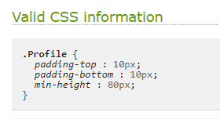
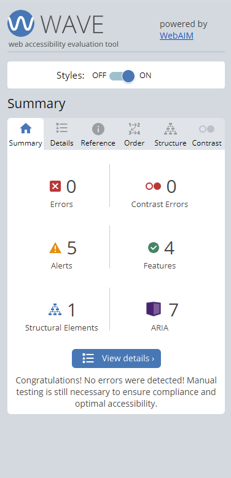

# **Fixit Forum**

Created by: Jeremy Simons
[Link to live site](https://ci-pp5-fixit-eda4cb59906b.herokuapp.com/)

This documentation covers the design, features, hosting, and testing of the React front end of this application. For details on the back end please visit [this repository](https://github.com/jeremyhsimons/fixit_drf_api)

## Introduction

Fixit is the forum for any budding DIY enthusiast to link up with like minded tinkerers to solve problems together. Where developers pool knowledge on platforms like [Stack Overflow](https://stackoverflow.com/), Fixit aims to be the go-to place for any user to find help solving their problem. After all, why should people struggle alone when most technical problems (whether a busted bike derailleur or a blocked drain) have probably already been solved?

This first iteration of the site has a separate front end and back end design. User data is stored and distributed via a Django REST API, and the front end site which users interact with is a separate application made using React. This first iteration focuses user content into 3 main categories: 
1. Bikes, cars, and other vehicular mechanics.
2. Electronics and circuitry
3. A more general DIY category that could cover most home improvement projects/problems.

## Contents
* [Project Goals](#project-goals) 
    * [For the user](#for-the-user)
    * [For the site owner](#for-the-site-owner)
* [User Experience](#user-experience) 
    * [Target audience](#target-audience)
    * [User requirements](#user-requirements)
    * [User Manual](#user-manual)
    * [User Stories](#user-stories)
* [Design](#design)
    * [wireframes](#wireframes)
* [Features](#features)
    * [Feature Ideas for future development](#feature-ideas-for-future-development)
* [Technologies Used](#technologies-used)
* [Deployment & Local Development](#deployment--local-development)
    * [Heroku deployment](#heroku-deployment)
    * [Forking GitHub Repository](#forking-github-repository)
    * [Cloning GitHub Repository](#cloning-github-repository)
* [Testing](#testing)
* [Validation](#validation)
* [Bugs](#bugs)
* [Credits](#credits)

## Project Goals

### New users
* To be able to sign up and post about a problem I'm having in a specific category of DIY
* To be able to view comments and suggestions from other users who can help me.
* To be able to scroll and search posts so that I can content from users who might have had the same issue as me.
* To upvote and star users/posts/comments that were helpful to me as a means of saying thank you.

### Existing users
* To comment on other users' posts so that I can help them and earn upvotes and stars.
* To see a list of popular profiles and see how close I am to being one of the top contributors.

## User Experience

### Target audience
* Bike and car enthusiasts who have an interest in maintaining their own vehicles.
* Electronics and hardware enthusiasts.
* Home Improvement enthusiasts, or new home owners looking for advice.
* Anyone interested in solving a one-off problem.
* Potentially other groups of enthusiasts as and when new categories are added to the database.

### User requirements

* To be able to scroll infinitely through a post list to browse content.
* To be able to search for posts and users based on keywords.
* To be able to bookamrk a helpful post in my account so that I can revisit it later.

### User Manual

Click the dropdown to view the user manual:

User Manual

 

### User Stories

#### Authentication

(1) As a new user I want to sign up so that I can use the site
(2) As an existing user I want to be able to sign in to the site to resume using the features
(3) As an existing user I want to be able to close and reopen the site without being logged out after a short period of time.
(4) As an existing user I want to be able to sign out from the app to protect my account.
(5) As an existing user I want to update my username and password so that I can keep my security details up to date.

#### Navigation

(6) As a new user I want to be directed to the signup page if I try to access any feature that is not permitted for unauthenticated, so that the site can remain secure.
(7) As an existing user I want to access all the features of the site through one simple navbar at the top of the page.
(8) As an existing user I want to access a list of the most popular profiles on the site on a sidebar/sidenav, so that I can easily see who is most influential.
(9) As an existing user I want to switch between different kinds of DIY post so that I can see content that is relevant to me.
(10) As an existing user I want to be able to search for posts using a search bar so that I can quickly look up posts that are relevant to me.

#### Profiles

(11) As a new user I want to have a profile automatically generated for me when I log in so other users can interact with me.
(12) As an existing user I want to be able to edit my profile so that I can keep my public details up-to-date.
(13) As an existing user I want to scroll a list of the most popular profiles (that have received the most stars) so (14) that I can access their posts.
(15) As an existing user I want to be able to access a single profile to view its details and the posts associated with it.
(16) As an existing user I want to ‘star’ a profile of someone I like/have found helpful so that I can see more of their content in future.
(17) As an existing user I want to ‘un-star’ a profile when I no longer wish to see content from this user.

#### Posts

(18) As a new user I want to be able to create a post with or without an image, so that I can ask my question/share my DIY problem with the community.
(19) As a new user I want to ‘infinitely’ scroll down a list of posts so that I can keep viewing content on the site.
(20) As a new user I want to be able to access a single post so that I can read it in full and read all the comments associated with it.
(21) As a new user I want to be able to bookmark a post I found helpful so that I can return to it later and re-read it.
(22) As a new user I want to upvote a post that is very timely or relevant, or if I’m sharing the same problem, so that I can support other members of the community and shape what is important on the site.
(23) As an existing user I want to remove a bookmark from a post so that I no longer have it saved.
(24) As an existing user I want to remove a post upvote from a post so that I no longer lend my support to that post.
(25) As an existing user I want to be able to edit my post so that I can correct any mistakes/keep my question up-to-date.
(26) As an existing user I want to be able to delete my post so that I can get rid of any unwanted or irrelevant data on the site.

#### Comments

(27) As a new user I want to be able to write a comment on a post so that I can interact with the person who created the post.
(28) As an existing user I want to be able to edit my comment so that I can fix any mistakes I made initially.
(29) As an existing user I want to be able to delete my comment so that I can withdraw what I posted initially.
(30) As an existing user I want to infinitely scroll through all the comments associated with a post (ordered by most upvoted) so that I can follow threads of answers and suggestions to other users’ problems.
(31) As an existing user I want to be able to upvote a comment so that I can lend my support to a contribution that helped me significantly.
(32) As an existing user I want to be able to withdraw my comment upvote so that I can withdraw my support for the commenter’s response

## Design

#### Fonts

[Google Fonts](https://fonts.google.com/) CDN was used to supply the fonts for this site.

Montserrat light was chosen as the font for site content because of its readability.

#### Colours

[Coolors.co](https://coolors.co/104f55-32746d-f4d8cd-01200f-011502) was used to generate the color palate of the site.

### Front End Libraries

[React Bootstrap v4](https://react-bootstrap-v4.netlify.app/) was used to expedite the front-end development process, specifically to provide row, column, and container components to order site content positionally.

Additionally the Image component was used extensively throughout the site to speed up formatting of images rendered on the front end.

[Font Awesome](https://fontawesome.com/) CDN was used to provide icons for the site.

The following React Libraries were also used:
* [React Router DOM](https://www.npmjs.com/package/react-router-dom) for linking internal urls in the site.
* [React MSW](https://mswjs.io/) for creating mock endpoints for testing.

### Wireframes

#### Phone screens

    
Authentication

    

    
Home

    

    
Profile

    

    
Post form

    

#### Tablet screens

    
Authentication

    

    
Home

    

    
Profile

    

    
Post form

    

#### Desktop screens

    
Authentication

    

    
Home

    

    
Profile

    

    
Post form

    

## Agile workflow

### Introduction

A Github projects kanban board was used to manage the tasks in the project. User stories were organised into epics and this guided how features in the backlog were organised for any given sprint.

Sprint 1: Navigation and Authentication

Sprint 2: Posts (CRUD) (+ Bookmarks + Upvotes)

Sprint 3: Comments (CRUD) (+ Upvotes)

Sprint 4: Profiles (+ Stars)

Screenshots:

### Flexibility

This approach to organising the project allowed for feature implementation to be assessed at each sprint. Each user story was assigned a label based on priority:

* Must have
* Should have
* Could have

Must-have features were all implemented, however upon starting the profiles sprint it became clear that there were too many features for the scope of this sprint so in order to maintain the best user experience with the existing features, the user story for a page on the site with a scrollable list of profiles that the user had 'starred' was given another label: 'wont have' to indicate that the first version of this site would not include this feature.

This does not mean that the site will never have this feature, and this user story has, in fact, been moved to the 'feature ideas for future development' section of this document.

## Features

### Authentication

#### Sign Up Page

* A form to create a new account for Fixit. 
* Uses password validation built into django rest auth.
* Any form errors are displayed to users.
* User stories covered: 1

#### Sign In Page
* A form that allows users to access all the sites features upon successful authentication.
* In the background, a JWT is issued to the user so that they can remain logged in for 24 hours, even if they close the browser in the meantime.
* User stories covered: 2, 3

#### Sign Out Button
* Allows the user to sign out from the navigation bar.
* Allows them to keep their account secure by destroying/invalidating the JWT that normally keeps them logged in.
* User stories covered: 4

#### Update Username & Password Forms
* Allows users to update their username and password respectively.
* Allows users to customise their profile, and also to keep their account secure by regularly updating passwords.
* User stories covered: 5

### Navigation

#### Auto redirect to signin

#### Navbar
* Always appears at the top of the page.
* Contains links to all the most important parts of the site.
* Is fully responsive and adjusts to hamburger menu/icons on smaller screens.
* User stories covered: 7, 9

#### Searchbar
* Appears at the top of every post feed in the site.
* Allows users to search for keyowrds in post titles and usernames.
* User stories covered: 10

### Feature ideas for future development

* A page on the site, reachable from the navbar for logged in users, to scroll through a list of profiles that they have starred.
* Feedback messages to users so that they can be sure that when they create a post or update, their actions have been successful.
* More categories for posts which could include furniture-making/woodwork, gardening/yard maintanence.
* A system whereby popular profiles are displayed as an aggregate of stars and upvotes that a user has received.
* Rewards or badges for top users based on their aggregate score.
* Direct messaging for users: e.g. if they see a profile with a status of 'ask me anything', they could reach out with a question.
  
## Technologies Used

* [React.js](https://react.dev/)

### Languages used

* JavaScript
* HTML / JSX
* CSS

### Other tools/websites/libraries used

* [Axios]() for making network requests to my API
* [React MSW]() for setting up mock endpoints.

## Deployment & Local Development

## Testing

## Validation

### HTML
The pages of this project were tested using the [W3C Validation service](https://validator.w3.org/) all pages passed with no errors or warnings.

    
Home

    

    
Post page

    

    
Create Post

    

    
Edit Post

    

    
Profile

    

    
Edit Profile

    

    
Edit Username

    

    
Edit Password

    

    
Sign in

    

    
Sign up

    

### CSS

All CSS files in this project were validated using the [W3C Jigsaw](https://jigsaw.w3.org/css-validator/#validate_by_input+with_options) validator. All modules passed with no errors or warnings.

    
Avatar.module.css

    

    
Button.module.css

    

    
Comment.module.css

    

    
CommentForm.module.css

    

    
CreatePostForm.module.css

    

    
NavigationBar.module.css

    

    
NotFound.module.css

    

    
PopularProfiles.module.css

    

    
Post.module.css

    

    
Profile.module.css

    

    
ProfileEditForm.module.css

    

    
ProfilePage.module.css

    

    
SearchBar.module.css

    

    
SignUpSignIn.module.css

    

### JSX

All Custom JavaScript files were validated using the [ESLint](https://eslint.org/) package. When installed, this package can be run by executing the command `npx eslint .filePath.js`. When the code is valid, no errors are recorded in the terminal. Screenshots of the commands being run are included below:

    
App.js

    

    
Components

    

    
Contexts

    

    
Hooks

    

    
Auth pages

    

    
Comment pages

    

    
Post pages

    

    
Profile pages

    

    
Utils

    

### Accessibility

All pages of this application were tested using the [WAVE validator](https://wave.webaim.org/) to ensure that all components accessible for screen-reading users. All pages passed with no errors.

    
Home

    

    
Post page

    

    
Create Post

    

    
Edit Post

    

    
Profile

    

    
Edit Profile

    

    
Edit Username

    

    
Edit Password

    

    
Sign in

    

    
Sign up

    

### Lighthouse

The application was tested using the [Lighthouse](https://developer.chrome.com/docs/lighthouse/overview/) tool in Chrome developer tools. The test was run for both desktop and mobile devices. Please note that performance figures can vary depending on internet speeds.

##### Desktop:

##### Mobile:

## Bugs

| Bug | Action Taken to Fix |
| --- | --- |
| When initially trying to run the react app using `$ npm start`. An error occurred saying that the build failed. | I tried installing and using an older long-term support version of node (v16.16.0). Once that was installed the command to start the app worked fine. Gitpod has been set to version 18.18 by default. |
| Submitting the signup form results a console error and doesn’t work as expected. The error is as follows: `Access to XMLHttpRequest at 'https://fixit-drf-api-b3b58b2bc39c.herokuapp.com/dj-rest-auth/registration/' from origin 'https://ci-pp5-fixit-eda4cb59906b.herokuapp.com' has been blocked by CORS policy: Response to preflight request doesn't pass access control check: No 'Access-Control-Allow-Origin' header is present on the requested resource` | Heroku hadn’t saved environment variables properly. Re-doing this solved the problem |
| Submitting a post create form resulted in a 400 bad request from the API. The http response said that the author was a required field. | Author was not defined as a read-only field in the post serializer in the API. Adding this fixed the issue. |
| bookmarking a post results in a 405 error returned from the API | I had typed the wrong endpoint into my axiosRes instance. I had entered /bookmark/ instead of /bookmarks/. |
| Upvoting a comment worked, but the state didn’t update when the user upvoted, and the page had to refresh in order for the upvote to appear. | This was fixed by making sure that the return statement for the handleupvote function checked if the comment.id passed to the map was equal to the id supplied from the parent component |
| The post title is a link and this has changed the text color/styles. | I forgot to wrap the post title and content in a separate card body component *outside* the link component that wraps the post image. |

## Credits

### 3rd party code used

This project drew extensively on the [Code Institute]() 'Moments' walkthrough project and ideas from here were implemented to maximise user experience in Fixit. This includes:
1. Custom user context and profile data context.
1. custom click toggle and redirect hooks.
1. organisation of components.
1. custom utils to handle fetching more data from the API, as well as checking status of JWTs.

[React Bootstrap](https://react-bootstrap-v4.netlify.app/) components were used to make features of the website including forms and navigation.

### images used

Images used for the site were taken from [Unsplash](https://unsplash.com/). Details for the contributors can be found here.

* [Michael Jin, crashed car](https://unsplash.com/photos/black-ford-car-ipHlSSaC3vk)
* [Hunter Haley, tools](https://unsplash.com/photos/four-handheld-tools-on-boards8OO2--t-HmQ)
* [Kenan Reed, broken car window](https://unsplash.com/photos/S5CUECZa8gw)
* [TopSphere Media, Rusty sedan](https://unsplash.com/photos/pzqTAdsDdyI )
* [Daniil Zameshaev, bike handlebars](https://unsplash.com/photos/_K4cfNFhPTw)
* [Nicholas Thomas, circuitboard spaghetti](https://unsplash.com/photos/3GZi6OpSDcY )
* [Tim Arterbury, smashed window](https://unsplash.com/photos/5Uh-wTSz-q0)
* [Viridi Green, dandelions](https://unsplash.com/photos/i-uBAOo_BBA)

### Tutorials used

* The [Gitpod documentation](https://www.gitpod.io/docs/introduction/languages/javascript) helped me troubleshoot issues with node versions and helped me set my workspace up.

### Other 3rd party libraries and online tools used

* [Convertio](https://convertio.co/) for converting images to webp format.
* [Cloud Convert](https://cloudconvert.com/jpg-to-webp) for converting images to webp format.
* [Loading.io](https://loading.io/) for generating the loading gif used on home page and popular profiles.

* [W3C Validation service](https://validator.w3.org/)
* [W3C Jigsaw](https://jigsaw.w3.org/css-validator/#validate_by_input+with_options)
* [ESLint](https://eslint.org/)
* [WAVE validator](https://wave.webaim.org/)
* [Lighthouse](https://developer.chrome.com/docs/lighthouse/overview/)

### Hosting platforms used.

* [Heroku](https://id.heroku.com/login) for hosting code
* [Cloudinary](https://cloudinary.com/) for image hosting

### Acknowledgements
